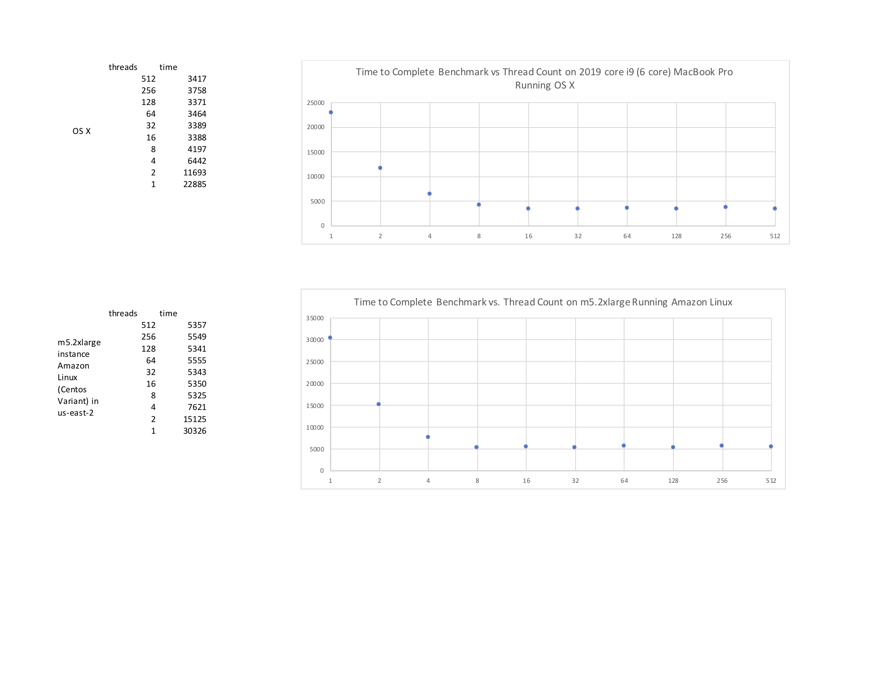

# Threads and Events

This is an investigation of the controversy about "threads vs. events".  For a good background, see [the original seda paper](http://www.sosp.org/2001/papers/welsh.pdf) and also [Mr. Welshs' Update](http://matt-welsh.blogspot.com/2010/07/retrospective-on-seda.html).

Representing the "events" faction we have many SEDA offspring and especially the reactive programming trend.  On the other hand one can also find [claims that "threads are cheap"](http://paultyma.blogspot.com/2008/03/writing-java-multithreaded-servers.html) so the  "thread per request" server architecture is actually fine and should be given priority because it is much simpler.  

The purpose of this project is to provide some information on the cost of context switching _in java_.  

# Methodology

2,048 arrays, each containing 200,000 random integers are generated.  The amount of time required to sort all of the the lists was measured, first using 1 thread, then dividing the 2,048 arrays between 2 threads (each handles 1,024), then 4 threads, and so forth up to 512 threads, each sorting only 4 arrays.  The source code is [here](src/main/java/com/hazelcast/demo/Sorter.java).  

The test was run on a 2019 MacBook Pro and on m5.2xlarge AWS instance.

# Results

In these tests, the time to sort all 2048 lists decreases as threads are added.  This continues until all of the available cores are used. This is expected.   

After that point, the JVM is switching applications on and off of real cores.

At least up to 512 cores, there appears to be very little cost associated with context switching.